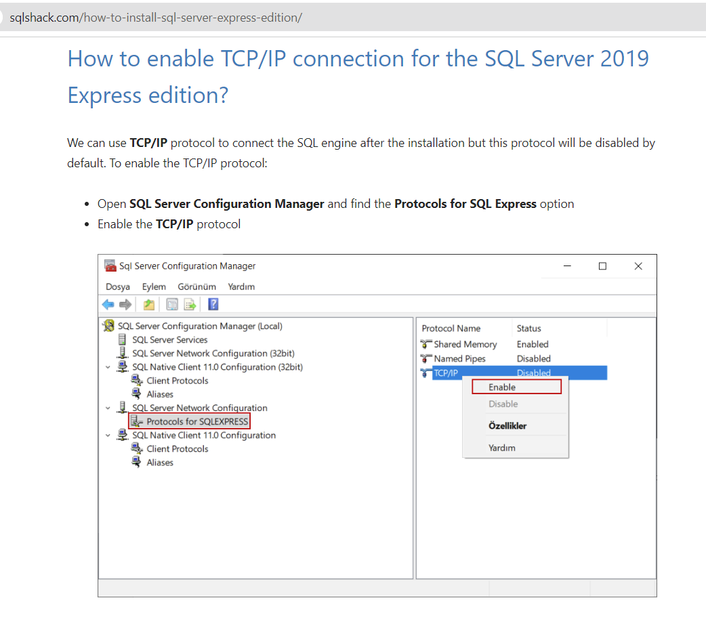
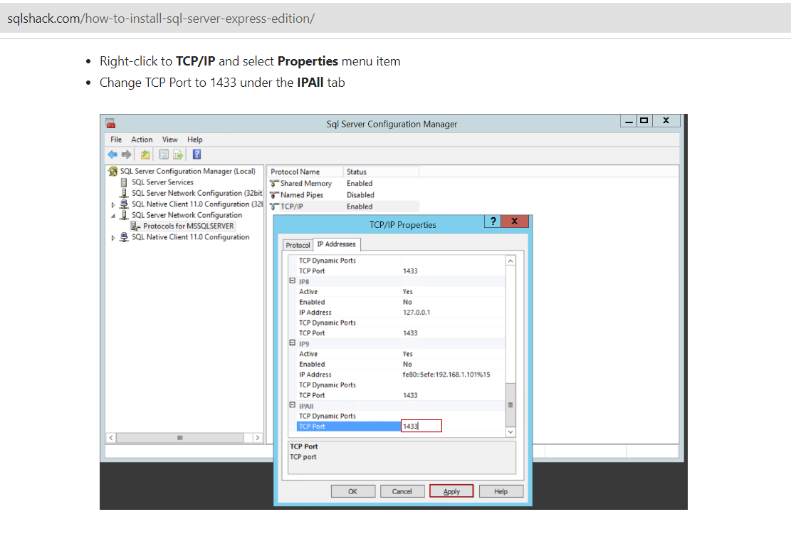
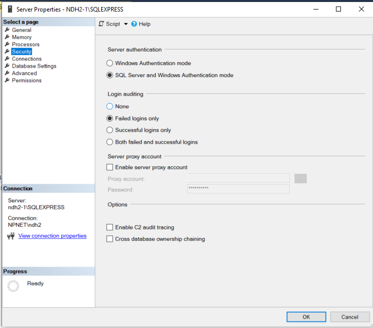

## Step 1: Microsoft SQL Server Express Configuration

This step focuses on configuring Microsoft SQL Server Express to enable communication with your Node.js application:

**1.1 Enable TCP/IP Protocol:**

Here's how to enable the TCP/IP protocol for remote connections to your SQL Server instance:

**Using SQL Server Configuration Manager:**

- Open **SQL Server Configuration Manager**. You can find it in your Windows Start menu or by searching for it.
- In the left pane, expand **SQL Server Network Configuration** and then your server instance name (usually "SQLEXPRESS").
- In the right pane, right-click on **Protocols for SQLEXPRESS** and select **Properties**.
- Under the **Protocol** tab, locate the **TCP/IP** entry.
- Ensure the **Enabled** checkbox is ticked.
- Under the **IP Addresses** tab, you'll see the **TCP Port**. This is the port on which your SQL Server listens for connections. The default port is usually 1433. You can leave it as the default or choose another available port.
- Click **OK** to save the changes.
- Restart your SQL Server service after making changes to the configuration.

**1.1.1 Enable TCP/IP protocol for SQL Server**

**1.1.2 Change TCP port to 1433 under IPAll tab**

**1.1.3 Restart SQL Server**

**1.2 Set Authentication Mode to Mixed Mode:**

Here's how to configure SQL Server Express to use mixed mode authentication:

**Using SQL Server Management Studio (SSMS):**

- Open **SQL Server Management Studio (SSMS)**. You can find it in your Windows Start menu or by searching for it.
- Connect to your SQL Server instance using appropriate credentials (usually the default administrator account "sa").
- In the Object Explorer window, right-click on your server instance name (usually "SQLEXPRESS") and select **Properties**.
- Go to the **Security** page.
- Under **Server authentication**, select **SQL Server and Windows Authentication mode**. This allows login using both Windows credentials and dedicated SQL Server logins.
- Click **OK** to save the changes.
- Restart your SQL Server service after making changes to the configuration.

**1.3 Create a Dedicated Login User (Optional but Recommended):**

For improved security, consider creating a dedicated SQL Server login user specifically for your Node.js application instead of using the "sa" account. Here's how:

- In SSMS, navigate to **Security** > **Logins**.
- Right-click on **Logins** and select **New Login**.
- In the **Login name** field, enter a descriptive name for your application user (e.g., "booksapi_user").
- Select **SQL Server authentication**.
- Set a strong password for the user.
- Under **Map to Server Roles**, grant the user the necessary permissions to access and modify the database. You can adjust these permissions based on your specific needs.
- Click **OK** to create the login user.

**Important Notes:**

- Restart your SQL Server service after making changes to the configuration.
- Remember to replace "SQLEXPRESS" with your actual server instance name if it differs.
- Use strong passwords for both the SQL Server instance (if using "sa") and the dedicated login user (if created).

By following these steps, you've successfully configured your Microsoft SQL Server Express instance to enable remote connections via TCP/IP and support mixed mode authentication. This allows your Node.js application to connect and interact with the database in the next steps of the practical.
