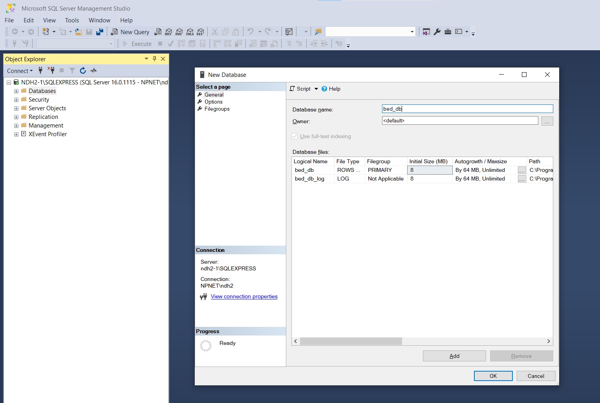
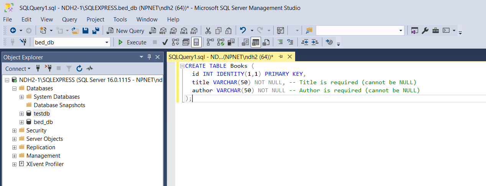
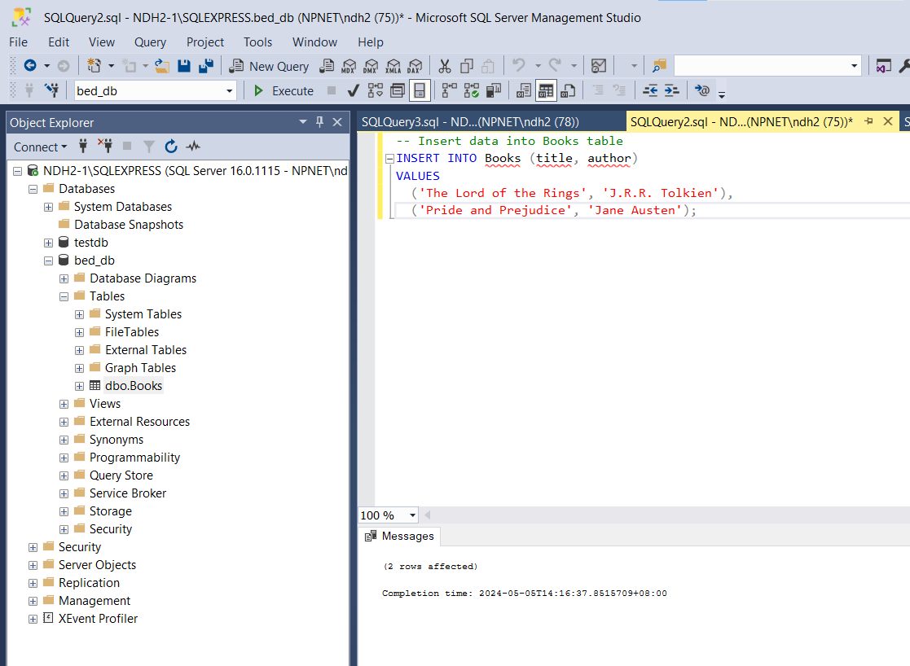
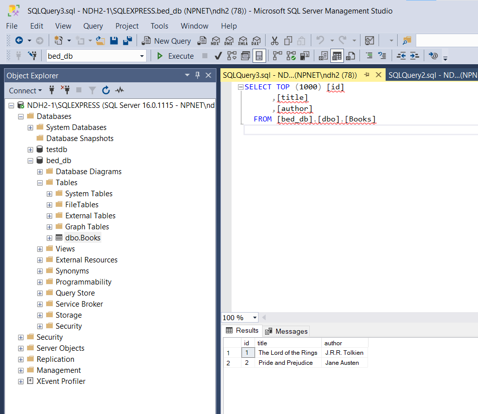

## Step 2: Creating Database and Populating Data

This step guides you through creating a database named "bed_db" and populating it with a "Books" table containing sample data in Microsoft SQL Server Express:

**1. Connect to SQL Server Management Studio (SSMS):**

- Open **SQL Server Management Studio (SSMS)**. You can find it in your Windows Start menu or by searching for it.
- Connect to your SQL Server instance using appropriate credentials (e.g., the "sa" account or windows authentication).

**2. Create the Database:**

- In the **Object Explorer** window, right-click on **Databases** and select **New Database**.
- In the **New Database** window, enter **bed_db** as the database name.
- Click **OK** to create the database.



**3. Execute the Scripts:**

- In the **Query** window, paste the following script:

```sql
CREATE TABLE Books (
  id INT IDENTITY(1,1) PRIMARY KEY,
  title VARCHAR(50) NOT NULL UNIQUE, -- Title is required and unique (cannot be NULL)
  author VARCHAR(50) NOT NULL -- Author is required (cannot be NULL)
);

-- Insert data into Books table
INSERT INTO Books (title, author)
VALUES
  ('The Lord of the Rings', 'J.R.R. Tolkien'),
  ('Pride and Prejudice', 'Jane Austen');
```

- Click the **Execute** button (or press F5) to run the script.

**3.1 Create table**



**3.2 Insert data**



**3.3 Verify data added**



**Explanation:**

- The first part of the script creates a table named "Books" with three columns:

  - `id`: An integer column with IDENTITY property set to automatically increment for each new record (primary key).
  - `title`: A varchar column with a maximum length of 50 characters, marked as NOT NULL and UNIQUE (required).
  - `author`: A varchar column with a maximum length of 50 characters, marked as NOT NULL (required).

- The second part of the script inserts two sample records into the "Books" table with titles and authors.

**Success:**

Upon successful execution, you should see a message indicating that the table was created and the data was inserted. You can verify this by right-clicking on the "bed_db" database in the Object Explorer and selecting **Refresh**. Then, expand the database and navigate to **Tables**. You should see the "Books" table with the inserted data.

This step provides a foundation for the next steps in the practical, where you'll connect to the database from your Node.js application and perform CRUD operations on the "Books" table.
