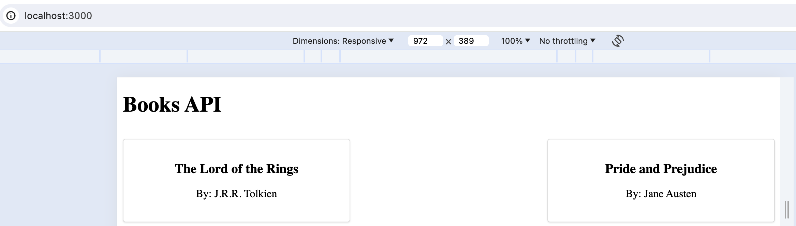

## Step 3: Building the View with HTML, CSS, and JavaScript

This step involves creating the front-end view files within separate folders for better organization. We'll use HTML, CSS, and JavaScript to display book information retrieved from your Books API.

**Folder Structure:**

- Create two folders inside your `public` directory:
  - `styles` - This folder will hold your CSS stylesheet.
  - `scripts` - This folder will hold your JavaScript code for data fetching and UI manipulation.

**1. Create the HTML Structure (`index.html`):**

- Inside the `public` folder, create a file named `index.html`. This will be the main HTML page for your view.
- Include the basic HTML structure with a head section for referencing styles and a body section for displaying book information:

```html
<!DOCTYPE html>
<html lang="en">
  <head>
    <meta charset="UTF-8" />
    <meta name="viewport" content="width=device-width, initial-scale=1.0" />
    <title>Books App</title>
    <link rel="stylesheet" href="styles/styles.css" />
  </head>
  <body>
    <h1>Books API</h1>
    <section id="book-list"></section>
    <script src="scripts/script.js"></script>
  </body>
</html>
```

- The `head` section includes a link to the `styles.css` file (located within the `styles` folder) and sets the title for your application.
- The `body` section contains an `<h1>` element for the title and a section with the ID `book-list`. This section will be dynamically populated with book information from the API using JavaScript. Finally, we reference the `script.js` file (located within the `scripts` folder) that will handle data fetching and UI updates.

**2. Style the UI (`styles.css`):**

- Create a file named `styles.css` inside the `styles` folder.
- Define CSS styles to format the various HTML elements on your page. Here's the code with a nicer style for the `book-list`:

```css
#book-list {
  display: flex;
  flex-wrap: wrap;
  justify-content: space-between;
  margin-top: 2rem;
  list-style: none;
  padding: 0;
}

.book {
  width: calc(33% - 1rem);
  margin-bottom: 1rem;
  padding: 1rem;
  border: 1px solid #ddd;
  border-radius: 4px;
  box-shadow: 0 1px 2px rgba(0, 0, 0, 0.1);
  background-color: #fff;
  text-align: center;
}

.book h2 {
  font-size: 1.2rem;
  margin-bottom: 0.5rem;
}
```

**Explanation:**

- We maintain the `display: flex`, `flex-wrap: wrap`, and `justify-content: space-between` properties for layout in the `#book-list`.
- We remove default list styling and set padding to zero.
- We define styles for the `.book` class to create a visually appealing layout for each book item.
- We adjust styles for book titles (h2 elements) for better readability.

**3. Fetch Data and Populate the View (`script.js`):**

- Create a file named `script.js` inside the `scripts` folder.
- Use JavaScript's Fetch API to make a request to your Books API endpoint (e.g., `/books`) to retrieve book data.
- Parse the JSON response from the API and extract information about each book (title, author, etc.).
- Utilize DOM manipulation techniques (e.g., `createElement`, `appendChild`) to dynamically create HTML elements for each book and populate them with the retrieved data.
- Update the content within the `#book-list` section of your `index.html` with the generated book elements.

Here's the JavaScript code:

```javascript
async function fetchBooks() {
  const response = await fetch("/books"); // Replace with your API endpoint
  const data = await response.json();

  const bookList = document.getElementById("book-list");

  data.forEach((book) => {
    const bookItem = document.createElement("div");
    bookItem.classList.add("book"); // Add a CSS class for styling

    // Create elements for title, author, etc. and populate with book data
    const titleElement = document.createElement("h2");
    titleElement.textContent = book.title;

    const authorElement = document.createElement("p");
    authorElement.textContent = `By: ${book.author}`;

    // ... add more elements for other book data (optional)

    bookItem.appendChild(titleElement);
    bookItem.appendChild(authorElement);
    // ... append other elements

    bookList.appendChild(bookItem);
  });
}

fetchBooks(); // Call the function to fetch and display book data
```

**Explanation:**

- The code iterates through the retrieved book data using a `forEach` loop.
- Inside the loop, we create individual book elements (`div` with the class `book`) for each book.
- We then create separate HTML elements (e.g., `<h2>` for title, `<p>` for author) and populate them with the corresponding book information extracted from the API response.
- Finally, we append these elements to the individual book item (`div`) and then append the entire book item to the `#book-list` section in your `index.html`.

**4. Running the Application:**

- Ensure your Express server is running (typically with `node app.js`).
- Open your web browser and navigate to `http://localhost:3000` to view your application.



This approach separates your concerns by organizing the front-end view files (HTML, CSS, JavaScript) within dedicated folders for better maintainability. The provided styles offer a more visually appealing layout for the book list.

This completes the basic steps for building the view for your Books API using HTML, CSS, and JavaScript integrated with your Express application. You can further customize the UI styles and functionality based on your preferences.
