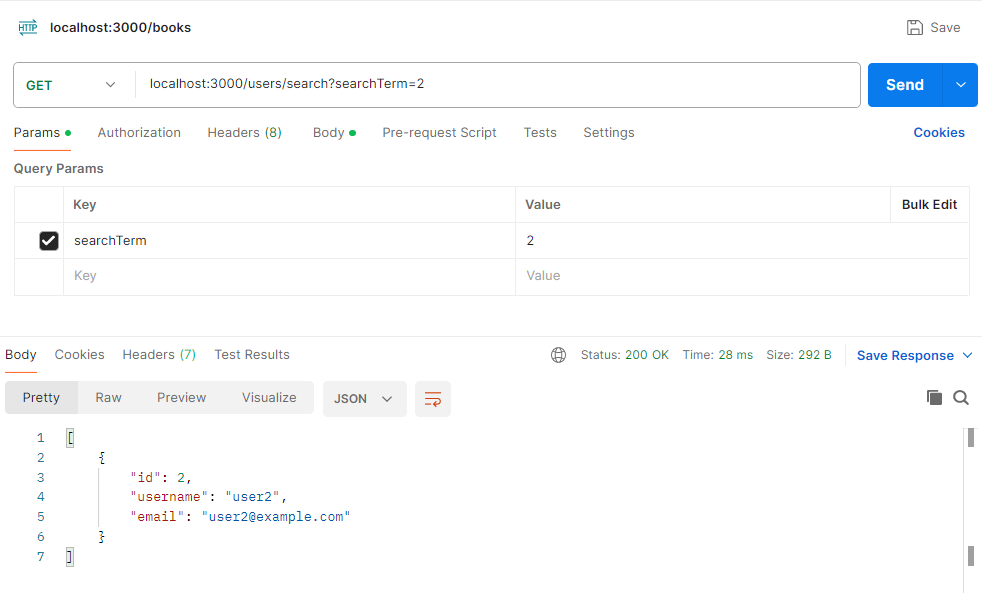

## Week 6 Practical - Step 5: Implement User Search and Postman Testing

This step expands the user management functionalities to include searching for users based on username or email.

**1. Implementation:**

**User Model (models/user.js):**

```javascript
const sql = require("mssql");
const dbConfig = require("../dbConfig");

class User {
  // ... existing properties and methods ...

  static async searchUsers(searchTerm) {
    const connection = await sql.connect(dbConfig);

    try {
      const query = `
        SELECT *
        FROM Users
        WHERE username LIKE '%${searchTerm}%'
          OR email LIKE '%${searchTerm}%'
      `;

      const result = await connection.request().query(query);
      return result.recordset;
    } catch (error) {
      throw new Error("Error searching users"); // Or handle error differently
    } finally {
      await connection.close(); // Close connection even on errors
    }
  }
}
```

**Explanation:**

- The `searchUsers` method takes a `searchTerm` as input (username or email fragment).
- It connects to the MSSQL database similar to the Books API implementation
- The SQL query uses `LIKE` with wildcards (`%`) to perform a case-insensitive search for the `searchTerm` in both username and email columns.
- The query results are retrieved using `connection.request().query` and returned as the `recordset`.
- Error handling is implemented using a `try...catch...finally` block.
- The connection is closed even on errors using the `finally` block.

**User Controller (controllers/usersController.js):**

```javascript
const User = require("../models/user");

// ... existing controller functions ...

async function searchUsers(req, res) {
  const searchTerm = req.query.searchTerm; // Extract search term from query params

  try {    
    const users = await User.searchUsers(searchTerm);
    res.json(users);
  } catch (error) {
    console.error(error);
    res.status(500).json({ message: "Error searching users" });
  }
}
```

**Explanation:**

- The `searchUsers` controller function extracts the `searchTerm` from the request query parameters.
- It calls the static `searchUsers` method in the `User` model.
- Upon successful search, the retrieved users are sent as a JSON response.
- Error handling sends a generic error message with a 500 status code.

**Main Application (app.js):**

```javascript
const usersController = require("./controllers/usersController");

// ... existing routes ...

app.get("/users/search", usersController.searchUsers);

module.exports = router;
```

**2. Testing with Postman:**

**Setting Up the Request:**

- Open Postman and create a new GET request.
- Enter the base URL of your backend API where the user search route is defined. For example, if your route is at `http://localhost:3000/users/search`, paste that URL into the address bar.

**Adding the Search Term:**

- User search typically uses query parameters. In Postman, click on the "Params" tab next to the URL.
- Click on "**+ Key**" to add a new query parameter.
- In the **Key** field, enter `searchTerm`.
- In the **Value** field, enter the search term you want to use. For example, you could enter "john" to search for users with "john" in their username or email.

**Sending the Request:**

- Ensure the request method is set to GET (as it's a search operation).
- Click the **Send** button to send the request to your backend API.

**Expected Behavior:**

- Upon successful execution, your backend API should return a JSON response containing an array of user objects matching the search term. This response structure should align with how you return users from your `User.searchUsers` method.



**Handling Errors:**

- If an error occurs during the search (e.g., database connection issue, invalid search term), your API should return a proper error response. This might include a status code like 400 (Bad Request) or 500 (Internal Server Error) along with an error message in the JSON response.

**3. Reasons for Expanding User Management:**

This step goes beyond the basic CRUD (Create, Read, Update, Delete) operations for user management by implementing a search functionality. Here's why expanding functionalities is important:

- **Improved Usability:** CRUD operations provide a foundation, but additional features enhance the user experience. Search allows users to quickly find specific data without needing to iterate through all users.
- **Enhanced Functionality:** Expanding user management allows for building more sophisticated applications. Search could be integrated with filtering or sorting functionalities for even more granular control over user data.
- **Scalability:** A well-designed user management system caters to future growth. Implementing search lays the groundwork for handling larger datasets and more complex user interactions.

**Concepts Learnt in User Search Functionality:**

- **Filtering:** The search feature acts as a filter, allowing users to narrow down the displayed data based on a specific criterion (search term).
- **Database Queries:** The search functionality utilizes SQL queries to retrieve user data matching the search term. Techniques like `LIKE` with wildcards enable flexible searches across username and email columns.
- **API Endpoints:** A new API endpoint (e.g., `/users/search`) is typically created to handle search requests. This endpoint interacts with the user model and database to retrieve the desired results.
- **Error Handling:** Robust error handling is crucial for search functionality. This includes handling potential issues like invalid search terms or database connection errors, and providing appropriate error messages to the user or application.

**Implementation Details:**

- The `searchUsers` method in the `user.js` model establishes the core logic for searching users. It connects to the database, constructs a query based on the search term, and retrieves matching user data.
- The `usersController.js` controller handles incoming search requests, extracts the search term from query parameters, and calls the `searchUsers` method from the user model. The response is then sent back to the client-side application.

By expanding user management beyond CRUD operations, you create a more robust and user-friendly system that can adapt to evolving needs and data growth. This approach lays the foundation for building more powerful and scalable applications.

**Bonus Challenge (Optional):** Can you implement a similar search functionality for Books API, allowing users to search for books based on title or author name?
