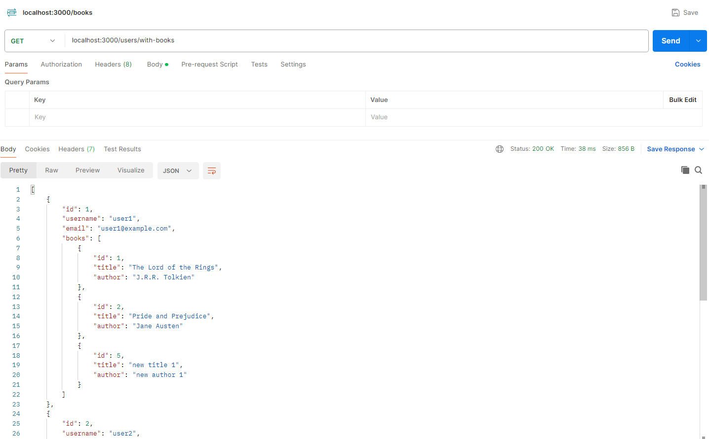

## Week 6 Practical - Step 6: Get Users with Books

This step focuses on retrieving a list of users along with their books, utilizing the `UserBooks` database table that represents the many-to-many relationships between `Users` and `Books`. Here's a breakdown of the implementation:

**1. User Model Enhancements (models/user.js):**

The `User` model introduces a new method `getUsersWithBooks` to fetch users with their book information.

```javascript
class User {
  // ... existing properties and methods ...

  static async getUsersWithBooks() {
    const connection = await sql.connect(dbConfig);

    try {
      const query = `
        SELECT u.id AS user_id, u.username, u.email, b.id AS book_id, b.title, b.author
        FROM Users u
        LEFT JOIN UserBooks ub ON ub.user_id = u.id
        LEFT JOIN Books b ON ub.book_id = b.id
        ORDER BY u.username;
      `;

      const result = await connection.request().query(query);

      // Group users and their books
      const usersWithBooks = {};
      for (const row of result.recordset) {
        const userId = row.user_id;
        if (!usersWithBooks[userId]) {
          usersWithBooks[userId] = {
            id: userId,
            username: row.username,
            email: row.email,
            books: [],
          };
        }
        usersWithBooks[userId].books.push({
          id: row.book_id,
          title: row.title,
          author: row.author,
        });
      }

      return Object.values(usersWithBooks);
    } catch (error) {
      throw new Error("Error fetching users with books");
    } finally {
      await connection.close();
    }
  }

  // ... other methods ...
}

module.exports = User;
```

**Explanation:**

- The `getUsersWithBooks` method:
  - Connects to the database.
  - Executes a SQL query with `LEFT JOIN`s to retrieve user information from `Users`, borrowed book IDs from `UserBooks`, and corresponding book details from `Books`.
  - It uses `ORDER BY u.username` to order users alphabetically.
  - The result set is processed to group users and their borrowed books. An object is created for each user, containing their details and an array of borrowed book objects.
  - Finally, an array of user objects with their borrowed books is returned.
  - Error handling is implemented using a `try...catch...finally` block.

**2. User Controller Enhancements (controllers/usersController.js):**

The `usersController.js` introduces a new function `getUsersWithBooks` to handle incoming requests for users with their books.

```javascript
const User = require("../models/user");

async function getUsersWithBooks(req, res) {
  try {
    const users = await User.getUsersWithBooks();
    res.json(users);
  } catch (error) {
    console.error(error);
    res.status(500).json({ message: "Error fetching users with books" });
  }
}

// ... other functions ...

module.exports = {
  // ... other exports ...
  getUsersWithBooks,
};
```

**Explanation:**

- The `getUsersWithBooks` controller function:
  - Calls the `User.getUsersWithBooks` method from the User model to retrieve users with their borrowed books.
  - Upon successful retrieval, it sends the user data as a JSON response.
  - Error handling is implemented to send a generic error message in case of issues.

**3. Integration and Testing:**

- Include the `getUsersWithBooks` function from `usersController.js` in your `app.js` for the desired endpoint (e.g., `/users/with-books`).

  ```javascript
  // ... existing Users routes ...
  app.get("/users/with-books", usersController.getUsersWithBooks);
  ```

- Use Postman or a similar tool to send a GET request to this endpoint.
- The response should be a JSON array containing user objects with their usernames, emails, and an array of borrowed book objects (including title and author).

  

With this step, we demonstrate the approach of how to combine functionalities from different models and controllers to achieve a more comprehensive user management system with book capabilities.

**Benefits of this approach**

- **Improved User Experience:** By combining functionalities, you create a more cohesive and user-friendly system. In this example, users can not only manage their accounts but also see their books within the same system. This eliminates the need to navigate to separate sections or applications for user management and book information.

- **Modular and Maintainable Codebase:** Separating functionalities into models and controllers promotes modularity. Models handle data access and logic specific to user or book data, while controllers handle user requests and interactions between different models. This separation makes the codebase easier to understand, maintain, and scale as the application grows in complexity.

- **Reusability of Components:** Controllers can leverage functionalities from multiple models as needed. This reusability reduces code duplication and simplifies future development efforts. For instance, user authentication logic might be implemented in a separate model and reused by controllers handling user login, and other functionalities that require user verification.

- **Scalability and Future-Proofing:** A well-structured application with separated concerns allows for easier integration of new features. As your application grows, you might want to add functionalities like book purchases or book recommendation. The modular approach makes it easier to incorporate these features by potentially reusing existing models and controllers or creating new ones that interact with the existing system.

In essence, by following the MVC pattern, combining functionalities from different models and controllers promotes a well-organized, maintainable, and scalable application that provides a better user experience and lays the groundwork for future growth based on business needs.
